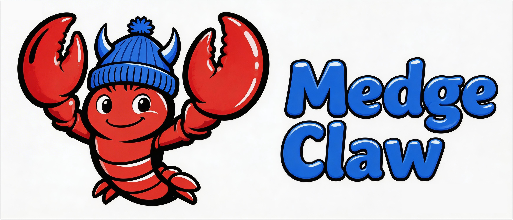

# 🧬 MedgeClaw
### An AI-Powered Biomedical Research Assistant

<p align="center">
  
</p>

**English** | [中文](README_ZH.md)

---

An open-source biomedical AI research assistant built on [OpenClaw](https://github.com/openclaw/openclaw) and [Claude Code](https://docs.claude.com/en/docs/claude-code/quickstart), integrating [140 K-Dense Scientific Skills](https://github.com/K-Dense-AI/claude-scientific-skills) for bioinformatics, drug discovery, clinical research, and more.

**Talk to your research assistant via WhatsApp, Slack, or Discord → it runs the analysis → you view results in RStudio or JupyterLab.**

---

## Architecture

```
User (voice / text via WhatsApp · Slack · Feishu · Discord)
        ↓
OpenClaw Gateway  (conversation layer)
        ↓  biomed-dispatch skill
Claude Code  (execution layer)
        ↓  K-Dense Scientific Skills (140 skills)
R + Python Analysis Environment (Docker)
        ↓                    ↓                    ↓
Research Dashboard :77xx    RStudio :8787       Feishu Rich Cards
  (real-time progress,      / JupyterLab :8888    (SVG panels → PNG
   code & output preview)   (interactive)          → interactive cards)
```

---

## What's Included

| Component                     | Description                                                                        |
| ----------------------------- | ---------------------------------------------------------------------------------- |
| **OpenClaw**                  | Conversational AI gateway — connects to your messaging apps                        |
| **Claude Code**               | Executes complex analysis workflows autonomously                                   |
| **K-Dense Scientific Skills** | 140 ready-to-use skills: genomics, drug discovery, clinical research, ML, and more |
| **Research Dashboard**        | Real-time web dashboard showing progress, code, outputs, and file previews         |
| **R Environment**             | DESeq2, Seurat, edgeR, clusterProfiler, survival, ggplot2, and more                |
| **Python Environment**        | Scanpy, BioPython, PyDESeq2, lifelines, scikit-learn, and more                     |
| **RStudio Server**            | Browser-based R IDE at `localhost:8787`                                            |
| **JupyterLab**                | Browser-based Python/R notebooks at `localhost:8888`                               |
| **biomed-dispatch**           | The bridge skill that routes your requests to Claude Code                          |
| **CJK Visualization**         | Auto-detects CJK fonts for matplotlib, no more tofu blocks in Chinese plots        |
| **SVG UI Templates**          | Professional SVG panels for lists, checklists, pipeline status, and rich reports   |
| **Feishu Rich Card**          | Send image-rich interactive cards in Feishu group chats for progress reports       |

---

## Prerequisites

- **Node.js 22+** — [nodejs.org](https://nodejs.org)
- **Docker + docker-compose** — [docs.docker.com](https://docs.docker.com/get-docker/)
- **Git**
- An API key from one of the supported model providers (see below)

---

## Quick Start

```bash
# 1. Clone with submodules (includes K-Dense Scientific Skills)
git clone --recurse-submodules https://github.com/xjtulyc/MedgeClaw
cd MedgeClaw

# 2. Run setup (creates .env template on first run)
bash setup.sh

# 3. Fill in your API key
nano .env

# 4. Run setup again to complete installation
bash setup.sh

# 5. Start the analysis environment
docker compose up -d

# 6. Start OpenClaw
openclaw onboard
```

Then open your messaging app and start talking to your assistant.

---

## Model Providers

Edit `.env` to choose your provider. All providers are drop-in replacements — no other changes needed.

| Provider                       | Base URL                             | Notes            |
| ------------------------------ | ------------------------------------ | ---------------- |
| **Anthropic Claude** (default) | `https://api.anthropic.com`          | Best quality     |
| **MiniMax 2.1**                | `https://api.minimax.chat/anthropic` | Available in CN  |
| **GLM-4.7** (Z.ai)             | `https://api.z.ai/api/anthropic`     | Available in CN  |
| **DeepSeek**                   | `https://api.deepseek.com/anthropic` | Low cost         |
| **Ollama** (local)             | `http://localhost:11434/v1`          | Fully offline    |

---

## ⚠️ Using Third-Party API Proxies

If you use a third-party API proxy (MiniMax, GLM, DeepSeek, or any non-Anthropic endpoint), you **must** configure `ANTHROPIC_SMALL_FAST_MODEL` in your `.env` file. Without this, Claude Code will fail silently.

### Why

Claude Code runs a **pre-flight safety check** before every bash command, using a lightweight "small fast model" (defaults to `claude-3-5-haiku`). Most third-party proxies don't support Haiku, causing the pre-flight to return 503 errors and hang indefinitely with:

```
⚠️ [BashTool] Pre-flight check is taking longer than expected.
```

### Fix

Add this line to your `.env`:

```bash
# Required for third-party API proxies:
ANTHROPIC_SMALL_FAST_MODEL=claude-sonnet-4-20250514  # or any model your proxy supports
```

Then re-run `bash setup.sh` to apply.

### How to verify

```bash
# Should complete in < 30 seconds. If it hangs, your SMALL_FAST_MODEL is wrong.
claude --dangerously-skip-permissions -p 'run: echo hello'
```

---

## Usage Examples

Once OpenClaw is running, send messages like:

```
Analyze RNA-seq data at data/counts.csv vs data/meta.csv, treatment vs control
```
```
Search PubMed for recent papers on CRISPR base editing, summarize top 10
```
```
Run survival analysis on data/clinical.csv, time=OS_months, event=OS_status
```
```
Perform single-cell RNA-seq analysis on the 10X data in data/10x/
```
```
Virtual screen EGFR inhibitors from ChEMBL (IC50 < 50nM), generate SAR report
```

Results are saved to `./outputs/` and viewable in RStudio (`localhost:8787`) or JupyterLab (`localhost:8888`).

---

## 📊 Research Dashboard

Every analysis task automatically spawns a **live web dashboard** — no need to wait for completion or check logs.

**Features:**
- **Real-time progress bar** — sticky header, always visible
- **Analysis plan overview** — all steps listed with completion status (✅/⏳)
- **Step-by-step breakdown** — each step shows: description → code (collapsible) → outputs
- **Inline previews** — images render directly, tables load from CSV files, text results highlighted
- **Full script access** — click to load the complete `.py` file, not just snippets
- **Copy & download everywhere** — 📋 copy code/tables/text, ⬇ download images/CSVs
- **Color-blind friendly** — IBM accessible palette + GitHub Dark theme
- **File browser** — browse all output artifacts with one-click preview

**How it works:**
```
AI completes a step → updates state.json → dashboard auto-refreshes (2s polling)
```

Three files, zero dependencies: `dashboard.html` + `state.json` + `dashboard_serve.py`.

See [docs/dashboard.md](docs/dashboard.md) for the full specification.

---

## Directory Structure

```
MedgeClaw/
├── docker/
│   ├── Dockerfile          # R + Python + RStudio + Jupyter
│   └── entrypoint.sh
├── skills/
│   ├── biomed-dispatch/    # Core bridge skill: routes tasks to Claude Code
│   │   └── SKILL.md
│   ├── dashboard/          # Research Dashboard: real-time task visualization
│   │   ├── SKILL.md        # Dashboard specification & state.json schema
│   │   ├── dashboard.html  # Single-file frontend (dark theme, IBM palette)
│   │   └── dashboard_serve.py  # Threaded HTTP server
│   ├── cjk-viz/            # CJK font detection for matplotlib
│   │   └── SKILL.md
│   ├── svg-ui-templates/   # Professional SVG panels (list, checklist, pipeline, report)
│   │   ├── SKILL.md
│   │   ├── assets/         # 4 template SVGs
│   │   └── references/     # Template guide
│   └── feishu-rich-card/   # Send image-rich interactive cards in Feishu
│       ├── SKILL.md
│       └── references/     # send_card.py helper
├── scientific-skills/      # git submodule → K-Dense (140 skills)
├── data/                   # Per-task data & analysis directories
│   └── <task_name>/
│       ├── dashboard/      # state.json + dashboard.html (auto-created)
│       └── output/         # Analysis outputs (CSV, PNG, etc.)
├── docs/                   # Project documentation
├── docker-compose.yml
├── setup.sh
├── CLAUDE.md               # Project instructions for Claude Code
├── .env.template
└── .gitmodules
```

---

## Updating K-Dense Scientific Skills

```bash
git submodule update --remote scientific-skills
```

---

## Contributing

Contributions welcome. The most valuable contributions are:

- Improvements to `skills/biomed-dispatch/SKILL.md` for better task routing
- New domain-specific skills in `skills/` (e.g., for specific clinical or lab workflows)
- Improvements to the Dockerfile (lighter image, newer package versions)

Please follow the [AgentSkills specification](https://agentskills.io/specification) for any new skills.

---

## Roadmap

- [x] Core architecture: OpenClaw + Claude Code + K-Dense Scientific Skills integration
- [x] Docker analysis environment with RStudio Server and JupyterLab
- [x] Third-party API proxy support (`ANTHROPIC_SMALL_FAST_MODEL` fix for BashTool pre-flight)
- [x] `CLAUDE.md` project instructions for Claude Code (docker exec execution model)
- [x] Multi-language analysis validation (Python + R, direct + Claude Code + K-Dense skills)
- [x] **Research Dashboard**: real-time web dashboard with progress tracking, step-by-step code & output preview, copy/download, color-blind friendly design
- [x] **CJK visualization skill**: auto-detect CJK fonts in Docker, solve `.ttc` font rendering issues
- [x] **Feishu integration**: connect to Feishu group chat for team collaboration
- [x] **SVG UI Templates**: professional-grade SVG panels (list, checklist, pipeline status, rich-text layout) with Material Design palette
- [x] **Feishu Rich Cards**: send image-rich interactive cards in Feishu — SVG/matplotlib → PNG → Card Kit API, with mixed text+image layout
- [ ] **Multi-agent workflow**: Parallel dispatch of sub-analyses (e.g., Python + R simultaneously) with result aggregation and cross-validation
- [ ] **Automated literature integration**: Connect PubMed/bioRxiv search → auto-generate introduction and discussion sections referencing analysis results
- [ ] **Interactive report builder**: Auto-generate publication-ready HTML/PDF reports with figures, tables, and statistical narratives from analysis outputs
- [ ] **Domain-specific skill chains**: Pre-built pipelines for common workflows (GWAS → PRS → Mendelian Randomization, scRNA-seq → trajectory → cell-cell communication)
- [ ] **Reproducibility engine**: Auto-generate Docker-based reproducibility packages with frozen environments, data checksums, and one-click re-execution

---

## License

MIT © 2026 [xjtulyc](https://github.com/xjtulyc)

This project bundles [K-Dense Scientific Skills](https://github.com/K-Dense-AI/claude-scientific-skills) as a git submodule (MIT). Individual skills within that repository may have their own license — check each `SKILL.md` for details.
